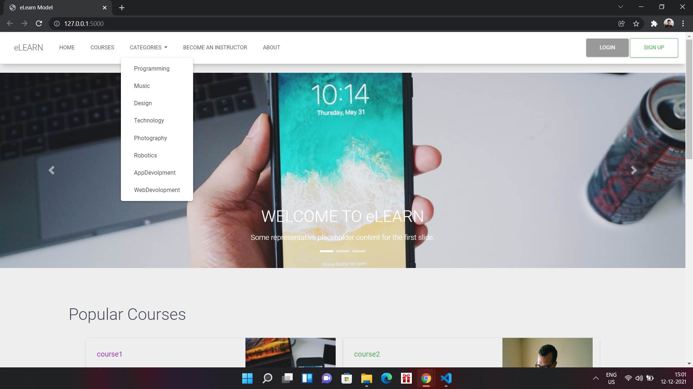
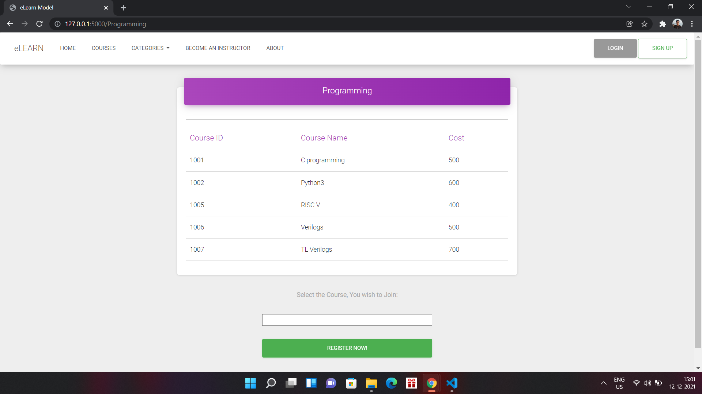
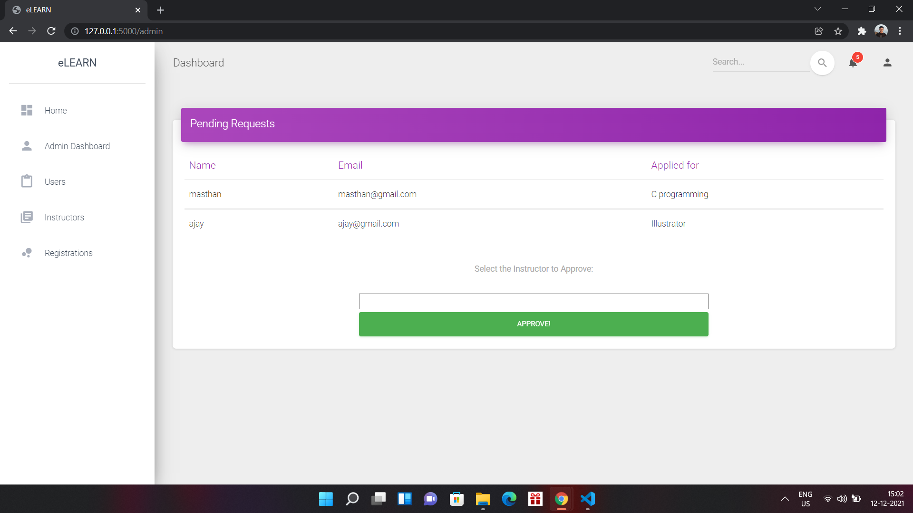
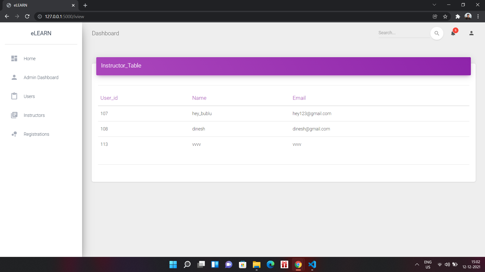
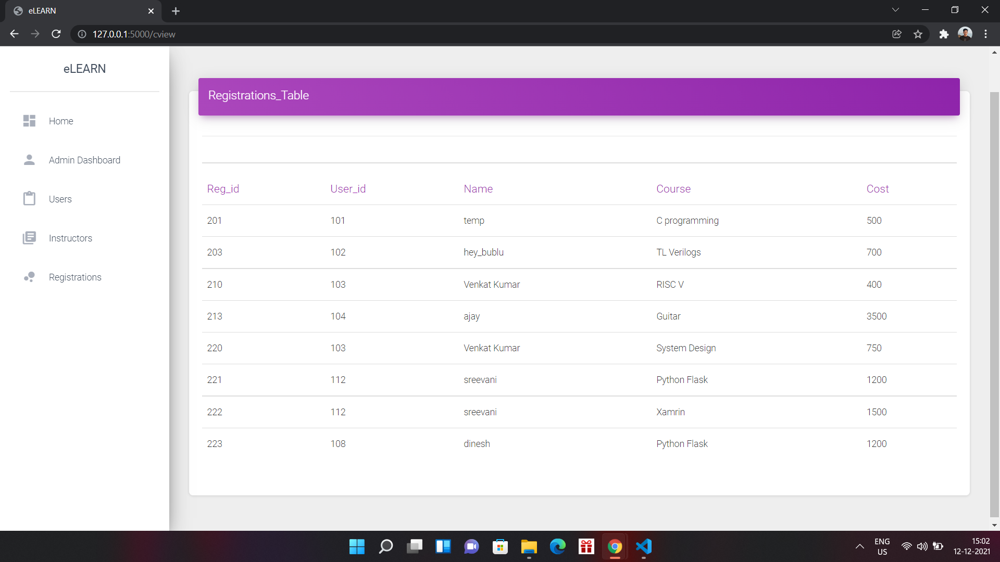
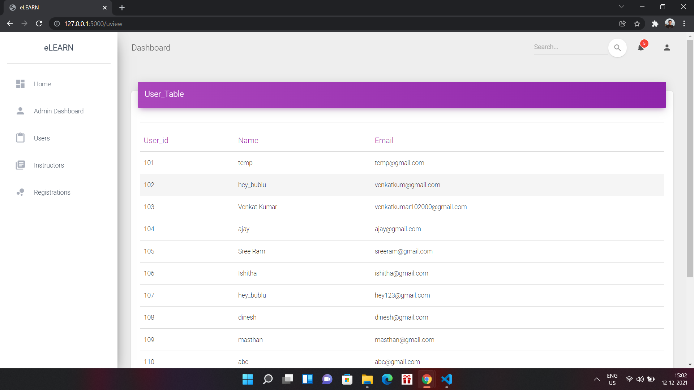

# eLearn_platform_model

-----------------------------------
Install all the nessesary modules required for the main.py run it the output contains a link which runs on local host. create all the necessary tables that are required or else files can imported from database_dumpfiles (mysql_workbench)

# Outputs
--------

-----

-------

------

-----

---------

-----

-----

